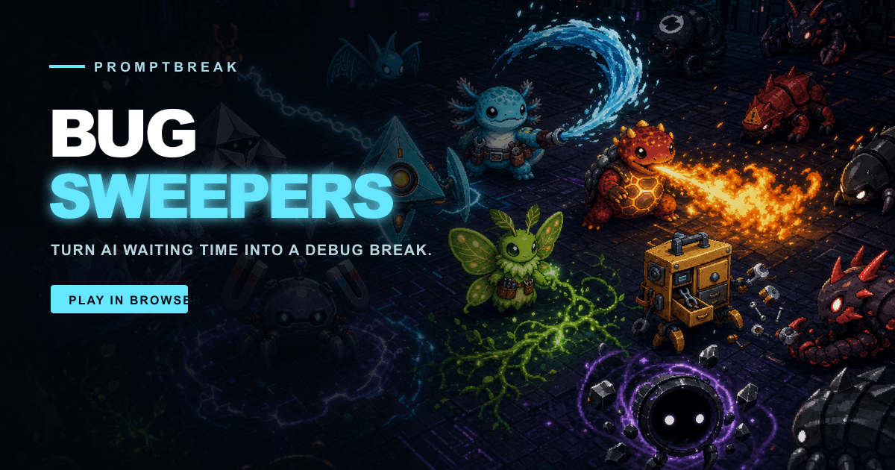

# PromptBreak: Bug Sweepers



A bilingual 2.5D browser action game that turns generative-AI waiting time into a quick, satisfying debug break.

## The problem

Generative AI removes work, but it also creates short, awkward pockets of waiting. They are too brief for another task and long enough to interrupt focus. PromptBreak gives that time a clear beginning and end: pick a Patchling, clear a software-themed mission, and return when the AI task is ready.

The current Build Week edition is a standalone game. A future desktop companion can listen for an AI-completion signal and show a lightweight “Task finished — pause the run?” prompt without forcing the player out of the current battle.

## Core experience

- Responsive Three.js world with keyboard and touch controls
- Japanese and English UI
- Twenty software-themed stages and a harder second run
- Two bosses per stage with a gated bug-outbreak phase
- Ten enemy types and telegraphed boss attacks
- Fourteen combat, movement, repair, and support upgrades
- Nine original Patchlings with distinct silhouettes and signature attacks
- `PATCH PARADE`, where every unlocked Patchling performs its own technique
- Stage 5 serpent-like mega boss with an emergency support arrival
- Destructible props, pickups, procedural music, pause support, and local rankings

## Original Patchlings

| Patchling | Identity | Signature |
| --- | --- | --- |
| Relay | Triangular courier drone | CHAIN RELAY |
| Tidal | Axolotl water mechanic | TIDAL PATCH |
| Kiln | Ceramic forge salamander | FORGE BREATH |
| Vector | Origami-kite scout | VECTOR LANCE |
| Anvil | Magnetic armored crab | MAGNETIC QUAKE |
| Lumen | Bioluminescent moth gardener | ROOTLIGHT SNARE |
| Parcel | Walking modular toolbox | TOOL DROP |
| Chroma | Prism-shell snail | PRISM FREEZE |
| Hollow | Eclipse orb with orbiting shards | EVENT HORIZON |

These characters were created specifically for PromptBreak and do not use third-party mascot designs.

## Controls

| Action | Desktop | Mobile |
| --- | --- | --- |
| Move | WASD / Arrow keys | Virtual joystick |
| Attack | Automatic | Automatic |
| PATCH PARADE | Space | Action button |
| Pause / resume | P / Esc | Pause button |

## Run locally

Requires Node.js 22.13 or later.

```bash
npm install
npm run dev
```

## Quality checks

```bash
npm run lint
npm test
npm audit --omit=dev
```

## How Codex accelerated the project

Codex was used across product redesign, Three.js gameplay, directional sprite integration, combat balancing, responsive UI, security review, and browser-based regression testing.

The main collaboration loop converted visual playtest feedback into small, verifiable changes: shared obstacle collision, gated boss progression, readable team attacks, mobile upgrade layouts, stage decoration, difficulty tuning, and safe local persistence.

Human direction defined the waiting-time problem, game concept, visual quality bar, stage themes, character-to-skill mapping, and release priorities. Codex handled implementation, inspection, testing, and iterative repair under those decisions.

## Architecture

- `app/page.tsx` — Three.js world, game loop, enemy AI, combat, audio, progression, and UI state
- `app/game.css` — HUD, cinematic overlays, menus, and responsive layouts
- `public/assets/companions/` — original directional Patchling atlases
- `public/assets/enemies/` — enemy sprite atlases
- `public/assets/world/` — stage textures
- `worker/index.ts` — Cloudflare-compatible entry point and security headers
- `tests/rendered-html.test.mjs` — production-output smoke tests

## Privacy and security

- No API keys, accounts, analytics, or remote leaderboard
- Progress and rankings remain in browser local storage
- External communication is limited to Google Fonts and the X compose page opened by the player
- Shared text is encoded, and external tabs use `noopener,noreferrer`
- The worker applies CSP, frame restrictions, permissions policy, referrer policy, and MIME-sniffing protection

## License

Source code is available under the [MIT License](./LICENSE). Image assets are covered separately by [ASSET_LICENSE.md](./ASSET_LICENSE.md).
